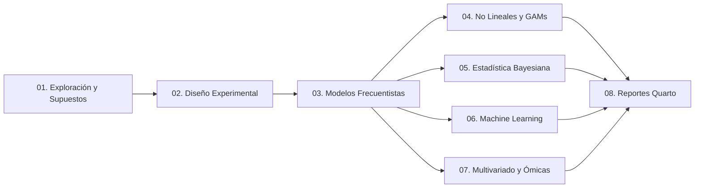

<div align="center">

# 🧬 BioAgro-Stats

### Repositorio de Análisis Estadístico Avanzado, Modelos Mixtos y Ciencia de Datos para Biotecnología y Agronomía

[](LICENSE)
[](https://www.r-project.org/)
[](https://github.com/PALP31/easyModels)
[](https://www.uc.cl/)

</div>

---

**BioAgro-Stats** es una suite completa y modular de scripts en **R** desarrollada por **Paúl Alexander López Peña** (Pontificia Universidad Católica de Chile) para la enseñanza universitaria de pregrado y la investigación científica de posgrado/doctorado en ciencias agrarias, biológicas y biotecnológicas.

El repositorio abarca desde la auditoría rigurosa de supuestos estadísticos hasta el modelado no lineal, modelos mixtos (LMM/GLMM), estadística bayesiana (`brms`), reducción dimensional multi-ómica (PCA Biplots, sPLS-DA, Heatmaps) y Machine Learning (`tidymodels`, `xgboost`).

---

## 🗺️ Mapa de Módulos del Repositorio



---

## 📂 Catálogo Detallado de Módulos y Scripts

| Módulo | Contenido Principal | Herramientas & Paquetes |
| :--- | :--- | :--- |
| **`01_Exploracion_Supuestos`** | Diagnóstico profundo de supuestos (Normalidad, Homocedasticidad, VIF, Cook's D), talleres interactivos en Quarto y notebooks. | `performance`, `DHARMa`, `car`, `easyModels` |
| **`02_Diseno_Experimental`** | Bloques Completos al Azar (DBCA), Alpha-Lattice para fitomejoramiento, Parcelas Divididas (Split-Plot / Split-Split) y Cuadrados Latinos (LSD). | `agricolae`, `lme4`, `emmeans`, `easyModels` |
| **`03_Modelos_Frecuentistas`** | ANOVA de 2 vías con bloques, GLM de conteos para edafofauna, LMM para bioensayos con *Trichoderma* y Medidas Repetidas en el Tiempo. | `lme4`, `lmerTest`, `emmeans`, `multcomp` |
| **`04_Modelos_No_Lineales_y_GAMs`** | Modelos Aditivos Generalizados (GAMs) para series temporales y Curvas Dosis-Respuesta ($EC_{50}/ED_{50}$) con modelos Log-Logísticos (LL.4). | `mgcv`, `gratia`, `drc`, `ggplot2` |
| **`05_Estadistica_Bayesiana`** | ANOVA bayesiano, GLMM bayesiano para conteo de esporas, interacción Genotipo $\times$ Ambiente ($G \times E$) y curvas de crecimiento no lineales. | `brms`, `tidybayes`, `bayesplot`, `Stan` |
| **`06_Machine_Learning`** | Random Forest para espectroscopía NIRS, XGBoost para tolerancia a estrés abiótico y SVM para diagnóstico fitopatológico. | `tidymodels`, `xgboost`, `vip`, `kernlab` |
| **`07_Multivariado_y_Omicas`** | PCA Biplots fisiológicos de publicación, PERMANOVA/NMDS para comunidades de edafofauna, sPLS-DA multi-ómica y Heatmaps jerárquicos. | `vegan`, `mixOmics`, `pheatmap`, `corrplot` |
| **`08_Reportes_Quarto`** | Plantillas reproducibles en Quarto (`.qmd`) para informes de consultoría bioestadística y manuscritos científicos. | `quarto`, `knitr`, `rmarkdown` |

---

## 🎓 Rutas de Aprendizaje Recomendadas

### 🌾 Ruta 1: Pregrado & Agronomía Aplicada
1. `01_Exploracion_Supuestos/01_diagnostico_experto_supuestos.R`
2. `02_Diseno_Experimental/01_dbca_basico.R`
3. `02_Diseno_Experimental/04_cuadrado_latino.R`
4. `03_Modelos_Frecuentistas/01_anova_trigo.R`
5. `07_Multivariado_y_Omicas/04_redes_correlacion_heatmap.R`

### 🔬 Ruta 2: Posgrado, Doctorado & Publicación Científica
1. `02_Diseno_Experimental/03_parcelas_divididas_splitplot.R`
2. `03_Modelos_Frecuentistas/04_medidas_repetidas_tiempo.R`
3. `04_Modelos_No_Lineales_y_GAMs/02_curvas_dosis_respuesta_drc.R`
4. `05_Estadistica_Bayesiana/03_jerarquico_bayesiano_gxe.R`
5. `07_Multivariado_y_Omicas/03_pca_biplot_fisiologia.R`
6. `07_Multivariado_y_Omicas/01_splsda_analisis_omicas.R`

---

## ⚡ Ejemplos Rápidos (Copy & Paste)

### 1. PCA Biplot Fisiológico de Publicación
```r
# Cargar script interactivo
source("07_Multivariado_y_Omicas/03_pca_biplot_fisiologia.R")
```

### 2. Curvas Dosis-Respuesta ($EC_{50}$) con `drc`
```r
# Ajuste de curvas log-logísticas LL.4 y cálculo de factor de resistencia
source("04_Modelos_No_Lineales_y_GAMs/02_curvas_dosis_respuesta_drc.R")
```

### 3. Modelos Mixtos y Medidas Repetidas con `easyModels`
```r
library(easyModels)

# Ajuste automático de medidas repetidas
modelo_rep <- analizar_medidas_repetidas(
  datos = datos_tiempo,
  formula_fijos = Altura ~ Tratamiento * Tiempo,
  sujeto = "ID",
  diagnosticos = FALSE
)

# Gráfico de líneas longitudinales
graficar_predichos(modelo_rep, predictor = "Tiempo", por = "Tratamiento", tipo_grafico = "lineas")
```

---

## 📦 Instalación de Dependencias

Para instalar todos los paquetes utilizados en el repositorio, ejecuta en la consola de R:

```r
paquetes <- c(
  "tidyverse", "lme4", "lmerTest", "emmeans", "car", "multcomp",
  "performance", "DHARMa", "agricolae", "drc", "mgcv", "gratia",
  "pheatmap", "corrplot", "patchwork", "tidymodels", "xgboost",
  "brms", "tidybayes", "bayesplot", "vegan"
)

paquetes_faltantes <- paquetes[!(paquetes %in% installed.packages()[, "Package"])]
if (length(paquetes_faltantes) > 0) {
  install.packages(paquetes_faltantes)
}

# Instalar easyModels desde GitHub
if (!requireNamespace("easyModels", quietly = TRUE)) {
  devtools::install_github("PALP31/easyModels")
}
```

---

## 👨‍🏫 Autor & Contacto

**Paúl Alexander López Peña**  
*Profesor de Aplicaciones Estadísticas (Pregrado) • Estudiante de Doctorado en Biotecnología Vegetal*  
**Pontificia Universidad Católica de Chile (PUC)**  
Email: [paullopezpena@gmail.com](mailto:paullopezpena@gmail.com) | [plopezp7@estudiante.uc.cl](mailto:plopezp7@estudiante.uc.cl)  
GitHub: [@PALP31](https://github.com/PALP31)
